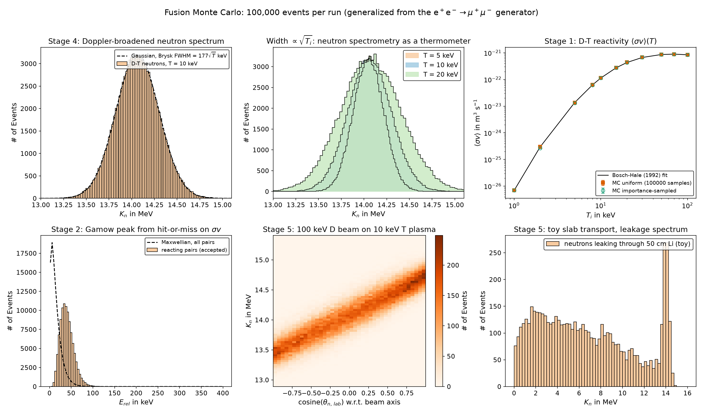

# Fusion Monte Carlo

**A C++ Monte Carlo event generator for D-T and D-D fusion: reactivity, reactant sampling, two-body kinematics, and Doppler-broadened neutron spectra. 100,000 events per run, validated against Bosch-Hale and Brysk.**

This project began as a QED event generator for e⁺e⁻ → μ⁺μ⁻ with a \(1+\cos^2\theta\) angular
distribution (kept at the [repository root](../)). The same three-stage Monte Carlo pipeline —
integrate a differential cross section, sample it by rejection, build final-state four-vectors —
was then generalized to thermonuclear fusion:

    D + T -> n (14.03 MeV) + alpha (3.56 MeV)        Q = 17.59 MeV
    D + D -> n (2.45 MeV)  + 3He (0.82 MeV)          Q =  3.27 MeV

| Original function      | New function              | What changed |
|------------------------|---------------------------|--------------|
| `monteCarloEstimate`   | `monteCarloReactivity*`   | Integrand is now σ(E)·v(E)·f_Maxwell(E;T) → ⟨σv⟩(T). Uniform and importance-sampled estimators |
| `HitOrMiss`            | `sampleReactantPairs`     | Draw ion velocities from Maxwellians (or a beam), accept with σv/W_max. W_max from a grid scan, not from the samples |
| `CreateEvents`         | `createEvents`            | Massive products, Q-value, exact two-body p*, isotropic CM angle via an `angularWeight` hook, Lorentz boost to the lab frame |
| —                      | `Hist`, `fwhm()`          | Lab neutron spectrum, FWHM vs Brysk formula |
| —                      | beam mode, D-D, `transportSlab` | Neutral-beam target, second reaction channel, toy slab transport |

`rand()/RAND_MAX` was replaced by `std::mt19937_64`.

## Repository layout

    src/Fusion_Monte_Carlo.cpp   single-file C++17 generator
    scripts/plot_results.py      regenerates figures/ from data/
    data/                        CSV output: per-event four-vectors and binned histograms for every run
    figures/                     result plots
    ../                          original e+e- -> mu+mu- generator, Feynman diagram, and histograms (repo root)

## Build

    g++ -O2 -std=c++17 src/Fusion_Monte_Carlo.cpp -o fusion_mc          # Linux / macOS / MinGW
    cl /EHsc /O2 /std:c++17 src\Fusion_Monte_Carlo.cpp /Fe:fusion_mc.exe   # MSVC (PowerShell)

## Run

    ./fusion_mc                                    # D-T, thermal, T = 10 keV
    ./fusion_mc --scan --transport 50              # add reactivity scan + 50 cm Li slab
    ./fusion_mc --reaction DD --T 10               # D-D neutron branch
    ./fusion_mc --mode beam --Ebeam 100 --T 10     # 100 keV D beam into 10 keV T plasma
    ./fusion_mc --T 20 --N 100000 --out data/run20     # options: --T --N --seed --out
    python scripts/plot_results.py                       # figures from the CSV output

Output CSVs per run: `<prefix>_events.csv` (one row per event, full lab four-vectors),
`*_spectrum_hist.csv`, `*_costheta_lab_hist.csv`, `*_pT_over_pstar_hist.csv`, `*_Erel_hist.csv`,
plus `*_reactivity_scan.csv` and `*_transport_escape_hist.csv` when requested.

## Physics

**Cross sections.** Bosch & Hale parametrization, σ(E) = S(E) / [E exp(B_G/√E)] with the
Padé S-factor, E = CM energy in keV, σ in mb. Valid 0.5–550 keV (D-T), 0.5–4900 keV (D-D).
Their ⟨σv⟩(T) fit is included only as a validation reference.
Source: H.-S. Bosch and G. M. Hale, *Nuclear Fusion* 32 (1992) 611, https://doi.org/10.1088/0029-5515/32/4/I07

**Stage 1 — reactivity.**
⟨σv⟩ = ∫ σ(E) v(E) f_M(E;T) dE, f_M = (2/√π) T^{-3/2} √E e^{-E/T}, v = √(2E/μ).
The uniform estimator is exactly the original method. The importance-sampled estimator draws
E ~ e^{-E/T}/T and weights by σv·(2/√π)√(E/T). Note that at 10 keV the exponential is *not*
a better proposal than uniform (the integrand peaks at the Gamow energy ≈ 4T, not at 0);
a Gaussian centred on the Gamow peak would do better. That is a deliberate lesson.

**Stage 2 — event sampling.** Each ion gets three Gaussian velocity components with
σ_β = √(T/mc²). Pairs are accepted with probability σ(E_rel)v_rel / W_max, so the accepted
pairs are distributed as the fusion *rate*. Mean reacting E_rel ≈ 40 keV at T = 10 keV
(the Gamow peak), versus 15 keV for a random pair.

**Stage 3 — kinematics.** √s = m₁ + m₂ + E_rel;
|p*| = √([s−(m₃+m₄)²][s−(m₃−m₄)²]) / (2√s); isotropic emission in the CM (s-wave, appropriate
for keV energies — the `angularWeight` hook is where a 1 + a₂P₂(cosθ) term would go); boost by
β_cm = (m₁β₁ + m₂β₂)/(m₁+m₂).

**Stage 4 — neutron spectrum.** Thermal motion of the CM Doppler-broadens the line. Brysk's
result: FWHM = √(8 ln2 · 2 m_n K_n0 T / (m_D+m_T)) ≈ 177 √T[keV] keV for D-T, ≈ 82.5 √T for D-D.
Source: H. Brysk, *Plasma Physics* 15 (1973) 611, https://doi.org/10.1088/0032-1028/15/7/001.
The mean is shifted upward by a few tens of keV because the reacting pairs carry E_rel ≈ Gamow
energy; this shift is the basis of Ballabio's spectrum corrections.

**Stage 5.** (a) `--reaction DD` uses the D(d,n)³He branch. (b) `--mode beam` makes ion 1
monoenergetic along +z (NBI or accelerator); the lab neutron energy then depends strongly on
emission angle (13.4–14.8 MeV for a 100 keV beam), which is how beam-target neutron
spectrometers see the beam. (c) `--transport <cm>` runs a toy slab: path length
s = −ln(u)/Σ_t, absorb-or-scatter by rejection, elastic energy loss on A = 7. The constants
(Σ_t = 0.067 cm⁻¹, P_breed = 0.20) are placeholders for ENDF/B data.

## Validation (100 000 samples, seed 20260904)

| Quantity | MC | Reference | Ratio |
|---|---|---|---|
| ⟨σv⟩_DT at 10 keV | 1.1360e-22 m³/s | 1.1362e-22 (Bosch-Hale) | 0.9999 |
| ⟨σv⟩_DT at 50 keV | 8.68e-22 | 8.65e-22 | 1.004 |
| ⟨σv⟩_DD(n) at 10 keV | 6.01e-25 | 6.02e-25 | 0.998 |
| D-T neutron FWHM, 5 / 10 / 20 keV | 391 / 556 / 780 keV | 395 / 559 / 790 (Brysk) | 0.99 |
| D-D neutron FWHM, 10 keV | 263 keV | 261 (Brysk) | 1.01 |
| n / α kinetic energy at rest | 14028 / 3561 keV | 14.03 / 3.56 MeV | — |

Statistical error on ⟨σv⟩ with 100 000 samples is ≈ 0.8 % (uniform) at 10 keV; the scan
points at 1–2 keV scatter more because the Gamow tail carries the integral there.

## Suggested next steps

1. Replace the exponential proposal in Stage 1 with a Gaussian at the Gamow peak and compare variances.
2. Add the D(d,p)T branch and D-³He (Bosch-Hale coefficients are in the paper).
3. Sample T_i and n_i from a tokamak profile (e.g. parabolic in normalized radius) and weight events by n_D n_T ⟨σv⟩ dV to get a volume-integrated spectrum.
4. Replace the toy slab constants with tabulated ENDF/B-VIII ⁶Li/⁷Li cross sections read from CSV.
5. Add the `1 + a₂ P₂(cosθ)` anisotropy in `angularWeight` for beam energies above a few hundred keV, which turns Stage 3 back into the original (1 + x²) hit-or-miss sampler.
